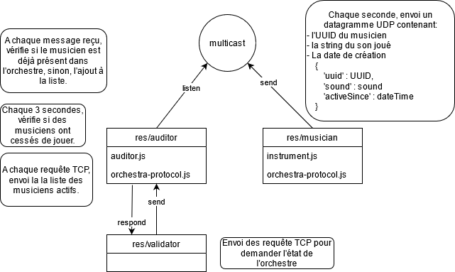

# Teaching-HEIGVD-RES-2020-Labo-Orchestra

## Admin

* **You can work in groups of 2 students**.
* It is up to you if you want to fork this repo, or if you prefer to work in a private repo. However, you have to **use exactly the same directory structure for the validation procedure to work**. 
* We expect that you will have more issues and questions than with other labs (because we have a left some questions open on purpose). Please ask your questions on Telegram / Teams, so that everyone in the class can benefit from the discussion.

## Objectives

This lab has 4 objectives:

* The first objective is to **design and implement a simple application protocol on top of UDP**. It will be very similar to the protocol presented during the lecture (where thermometers were publishing temperature events in a multicast group and where a station was listening for these events).

* The second objective is to get familiar with several tools from **the JavaScript ecosystem**. You will implement two simple **Node.js** applications. You will also have to search for and use a couple of **npm modules** (i.e. third-party libraries).

* The third objective is to continue practicing with **Docker**. You will have to create 2 Docker images (they will be very similar to the images presented in class). You will then have to run multiple containers based on these images.

* Last but not least, the fourth objective is to **work with a bit less upfront guidance**, as compared with previous labs. This time, we do not provide a complete webcast to get you started, because we want you to search for information (this is a very important skill that we will increasingly train). Don't worry, we have prepared a fairly detailed list of tasks that will put you on the right track. If you feel a bit overwhelmed at the beginning, make sure to read this document carefully and to find answers to the questions asked in the tables. You will see that the whole thing will become more and more approachable.


## Requirements

In this lab, you will **write 2 small NodeJS applications** and **package them in Docker images**:

* the first app, **Musician**, simulates someone who plays an instrument in an orchestra. When the app is started, it is assigned an instrument (piano, flute, etc.). As long as it is running, every second it will emit a sound (well... simulate the emission of a sound: we are talking about a communication protocol). Of course, the sound depends on the instrument.

* the second app, **Auditor**, simulates someone who listens to the orchestra. This application has two responsibilities. Firstly, it must listen to Musicians and keep track of **active** musicians. A musician is active if it has played a sound during the last 5 seconds. Secondly, it must make this information available to you. Concretely, this means that it should implement a very simple TCP-based protocol.


### Instruments and sounds

The following table gives you the mapping between instruments and sounds. Please **use exactly the same string values** in your code, so that validation procedures can work.

| Instrument | Sound         |
|------------|---------------|
| `piano`    | `ti-ta-ti`    |
| `trumpet`  | `pouet`       |
| `flute`    | `trulu`       |
| `violin`   | `gzi-gzi`     |
| `drum`     | `boum-boum`   |

### TCP-based protocol to be implemented by the Auditor application

* The auditor should include a TCP server and accept connection requests on port 2205.
* After accepting a connection request, the auditor must send a JSON payload containing the list of <u>active</u> musicians, with the following format (it can be a single line, without indentation):

```
[
  {
  	"uuid" : "aa7d8cb3-a15f-4f06-a0eb-b8feb6244a60",
  	"instrument" : "piano",
  	"activeSince" : "2016-04-27T05:20:50.731Z"
  },
  {
  	"uuid" : "06dbcbeb-c4c8-49ed-ac2a-cd8716cbf2d3",
  	"instrument" : "flute",
  	"activeSince" : "2016-04-27T05:39:03.211Z"
  }
]
```

### What you should be able to do at the end of the lab


You should be able to start an **Auditor** container with the following command:

```
$ docker run -d -p 2205:2205 res/auditor
```

You should be able to connect to your **Auditor** container over TCP and see that there is no active musician.

```
$ telnet IP_ADDRESS_THAT_DEPENDS_ON_YOUR_SETUP 2205
[]
```

You should then be able to start a first **Musician** container with the following command:

```
$ docker run -d res/musician piano
```

After this, you should be able to verify two points. Firstly, if you connect to the TCP interface of your **Auditor** container, you should see that there is now one active musician (you should receive a JSON array with a single element). Secondly, you should be able to use `tcpdump` to monitor the UDP datagrams generated by the **Musician** container.

You should then be able to kill the **Musician** container, wait 5 seconds and connect to the TCP interface of the **Auditor** container. You should see that there is now no active musician (empty array).

You should then be able to start several **Musician** containers with the following commands:

```
$ docker run -d res/musician piano
$ docker run -d res/musician flute
$ docker run -d res/musician flute
$ docker run -d res/musician drum
```
When you connect to the TCP interface of the **Auditor**, you should receive an array of musicians that corresponds to your commands. You should also use `tcpdump` to monitor the UDP trafic in your system.


## Task 1: design the application architecture and protocols

| #  | Topic |
| --- | --- |
|Question | How can we represent the system in an **architecture diagram**, which gives information both about the Docker containers, the communication protocols and the commands? |
| |  |
|Question | Who is going to **send UDP datagrams** and **when**? |
| | Chaque container musicien envoi un datagramme par seconde |
|Question | Who is going to **listen for UDP datagrams** and what should happen when a datagram is received? |
| | Le container auditeur. Si le datagramme contient un uuid connu, il met à jour son heure de dernier message, sinon, il l'ajoute au dictionnaire qui liste les musiciens actifs. |
|Question | What **payload** should we put in the UDP datagrams? |
| | L'UUID du musicien, le son de son instrument, ainsi que la date/heure de création du container. |
|Question | What **data structures** do we need in the UDP sender and receiver? When will we update these data structures? When will we query these data structures? |
| | Nous envoyons un objet JSON formaté en string. <br/>Les données envoyées par les musiciens ne sont jamais modifiées.<br/>L'auditeur crée un tableau de musicien représentant l'orchestre (JSON). Ce tableau contient les donnée envoyées par les musiciens, ainsi que la date/heure de dernière activité connue. L'auditeur modifie cette date/heure lors du contrôle des musiciens toujours actif. <br/>L'auditeur retourne la liste des musiciens lorsqu'on lui fait une requête TCP. |


## Task 2: implement a "musician" Node.js application

| #  | Topic |
| ---  | --- |
|Question | In a JavaScript program, if we have an object, how can we **serialize it in JSON**? |
| | JSON.parse() |
|Question | What is **npm**?  |
| | npm est le gestionnaire de paquets officiel de Node.js |
|Question | What is the `npm install` command and what is the purpose of the `--save` flag?  |
| | Cette commande installe un nouveau module NodeJs. `--save` pour sauver ce module en local ce qui nous permet de le copier dans le container par la suite. |
|Question | How can we use the `https://www.npmjs.com/` web site?  |
|  | En utilisant la barre de recherche principale, pour chercher des modules par exemple. |
|Question | In JavaScript, how can we **generate a UUID** compliant with RFC4122? |
| | const { v4: uuidv4 } = require('uuid');<br/>uuidv4();<br/>https://www.npmjs.com/package/uuid |
|Question | In Node.js, how can we execute a function on a **periodic** basis? |
| | setInterval(<function>, <time ms>); |
|Question | In Node.js, how can we **emit UDP datagrams**? |
| | Créer un socket, puis socket.send(...) |
|Question | In Node.js, how can we **access the command line arguments**? |
| | process.argv[<arg num>] |


## Task 3: package the "musician" app in a Docker image

| #  | Topic |
| ---  | --- |
|Question | How do we **define and build our own Docker image**?|
| | On créer un dokerfile, puis: `docker build -t name <path_to_dockerfile>` |
|Question | How can we use the `ENTRYPOINT` statement in our Dockerfile?  |
| | `ENTRYPOINT ["node", "/opt/app/instrument.js"]`, comme avec `CMD []` |
|Question | After building our Docker image, how do we use it to **run containers**?  |
| | `docker run -d res/musician piano`<br/>"piano" est passé en argument à l'entrypoint -> le script js |
|Question | How do we get the list of all **running containers**?  |
| | `docker ps ` |
|Question | How do we **stop/kill** one running container?  |
| | `docker stop <id/name>`<br/>`docker kill <id/name>` |
|Question | How can we check that our running containers are effectively sending UDP datagrams?  |
| | Avec Wireshark, on vérifie ce qui est envoyé avec l'ip du container. |


## Task 4: implement an "auditor" Node.js application

| #  | Topic |
| ---  | ---  |
|Question | With Node.js, how can we listen for UDP datagrams in a multicast group? |
| | on bind le socket, puis `socket.addmembership(<multicast ip>)` |
|Question | How can we use the `Map` built-in object introduced in ECMAScript 6 to implement a **dictionary**?  |
| | Comme un tableau de clé: valeur |
|Question | How can we use the `Moment.js` npm module to help us with **date manipulations** and formatting?  |
| | Moment permet de comparer facilement deux date pour avoir une différence de temps, avec l'unité voulue.<br/>`if(moment().diff(item.lastActive, 's') > 5)` calcule le nombres de secondes séparant le temps présent avec le temps stocké dans `lastActive`. |
|Question | When and how do we **get rid of inactive players**?  |
| | Chaque trois secondes l'auditeur contrôle la liste de musicien. Si le temps de dernière activité est supérieur à 5 seconde, le musicien est supprimé de la liste.<br/>`orchestra.forEach(function(item, index)` On parcours la liste des musiciens.<br/>`orchestra.splice(index, 1);` Si la condition de temps est validée, on supprime l'élément à l'index `index` |
|Question | How do I implement a **simple TCP server** in Node.js?  |
|  | Avec le module `net`: `var server = net.createServer(function(socket)` |


## Task 5: package the "auditor" app in a Docker image

| #  | Topic |
| ---  | --- |
|Question | How do we validate that the whole system works, once we have built our Docker image? |
| | Dans un premier temps en utilisant Wireshark pour valider la communication UDP entre les containers créés, puis en lançant le script de validation.<br/>On peut aussi lire les logs des containers, ou afficher des messages dans les logs pour debugger. |


## Constraints

Please be careful to adhere to the specifications in this document, and in particular

* the Docker image names
* the names of instruments and their sounds
* the TCP PORT number

Also, we have prepared two directories, where you should place your two `Dockerfile` with their dependent files.

Have a look at the `validate.sh` script located in the top-level directory. This script automates part of the validation process for your implementation (it will gradually be expanded with additional operations and assertions). As soon as you start creating your Docker images (i.e. creating your Dockerfiles), you should try to run it.
